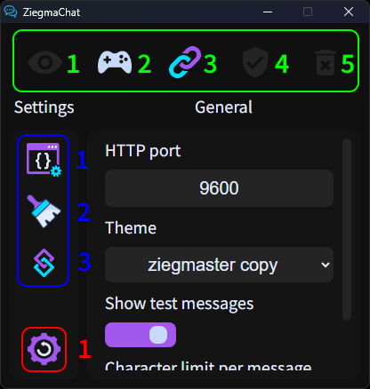

<h1 align="center">ZiegmaChat user guide</h1>

**Greetings, streamer! Here you will find brief instructions on how to use the program. It's easier than it seems, let's get started!**

# Installation

Your first step will be to install the program if you haven't already. To do this, go to [releases](https://github.com/TrueZiegmaster/ZiegmaChat/releases) and download the latest one, all the coolest and most amazing features (and bugs too :P) are always in the latest versions, try to always be on trend with ZiegmaChat!  
After you have installed the .zip archive, unzip it somewhere and you are done!

# User interface and application features

**After you have completed the installation and successfully launched the program, Its Majesty, the, appears before your eyes!**

${\Large\text{\color[rgb]{0,1,0}Green \ section}}$

| **Number** | **Name** | **Description** |
| ------ | ------ | ------ |
| $${\Large\text{\color[rgb]{0,1,0}1}}$$ | Toggle visibility | Shows/Hides draggable chatbox. |
| $${\Large\text{\color[rgb]{0,1,0}2}}$$ | Toggle game mode | Enables/Disables the overlay mode for the chatbox when it's visible. |
| $${\Large\text{\color[rgb]{0,1,0}3}}$$ | Copy widget URL | Click and get the URL to your clipboard. (Use it in a browser to test or make a browser source in OBS.) |
| $${\Large\text{\color[rgb]{0,1,0}4}}$$ | Apply changes | Save all changes you have made. |
| $${\Large\text{\color[rgb]{0,1,0}5}}$$ | Discard changes | Discard all changes. Nothing else would happen, you're safe! |

${\Large\text{\color[rgb]{0,0,1}Blue \ section}}$

| **Number** | **Name** | **Description** |
| ------ | ------ | ------ |
| $${\Large\text{\color[rgb]{0,0,1}1}}$$ | General settings tab | General settings are used by all themes, they are global. |
| $${\Large\text{\color[rgb]{0,0,1}2}}$$ | Theme settings tab | Theme settings work only for the current selected theme. (The list of settings is determined by the theme author.) |
| $${\Large\text{\color[rgb]{0,0,1}3}}$$ | Streamer.bot settings tab | This tab is needed to configure the connection to Streamer.bot |

${\Large\text{\color[rgb]{1,0,0}Red \ section}}$

| **Number** | **Name** | **Description** |
| ------ | ------ | ------ |
| $${\Large\text{\color[rgb]{1,0,0}1}}$$ | Reset to dafults | Restore the default settings if something went wrong or if you just want that. |

# Streamer.bot & OBS websocket

**The trick to make everything work is to follow instructions below. Good luck with that!**

# **OBS**

1. Open Tools > Websocket Server Settings in OBS.
2. Enable Websocket server.
3. Set the port below (e.g., 4455).
4. Enable authentication just in case.
5. Set the password and remember or copy it.
6. Press **"Apply"** and then **OK**.

> ✅  
> After that OBS can accept requests from Streamer.bot

# **Streamer.bot**

1. Open **Stream Apps** tab.
2. Select OBS or another app.
3. Add new connection. (Currently right click on the empty space.)
4. Use Version v5.x and the same port and password.
5. Enable auto connect and reconnect.
6. Open **Servers/Clients** tab > Websocket Server.
7. Enable auto start.
8. Set the port (Not the same as previous one! e.g, 8080. If it's in use > try any other.)

> ✅   
> After that Streamer.bot can connect to OBS and accept requests from ZiegmaChat

# **ZiegmaChat**

1. Open Streamer.bot tab.
2. Set the same port that you've set in Streamer.bot websocket server.
3. Press **Apply changes**.

> ✅  
> You can now click the "Copy widget URL" button and paste it into your browser or into OBS browser source.

✨ **ENJOY!!!** ✨

